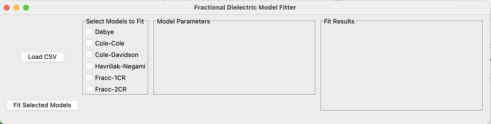
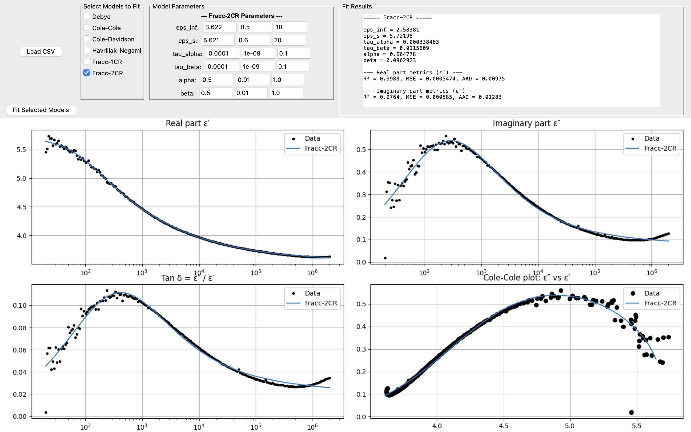

# ⚡ pyDipolAI

A Python-based tool for fitting dielectric spectroscopy data using classic and fractional models.  
Includes Debye, Cole-Cole, Havriliak-Negami, and fractional models, with plans to integrate fuzzy logic and Bayesian optimization.  

---

## ✨ Features
- 🖥️ GUI-based model fitting for dielectric spectroscopy.
- 📊 Visual comparison of multiple dielectric models.
- 🧩 Modular design using Python classes for easy extension.
- ⚙️ Adjustable parameters and instant plotting of fitted curves.

---

## 📈 Models Implemented
- Debye
- Cole-Cole
- Cole-Davidson
- Havriliak-Negami
- Fractional cap-resistor models *(1CR, 2CR)*

---

## 🚀 FBN Project
- 🤖 Integrate fuzzy logic for intelligent model selection.
- 📉 Add Bayesian optimization for parameter fitting.
- 🧪 Include datasets for more polymers and experimental cases.

---

## 📂 Project Structure
pyDipolAI/
│
├── models/               # Model classes (Debye, Cole–Cole, etc.)
├── DielectricModelUI.py  # Main GUI application
├── requirements.txt      # Python dependencies
├── README.md             # Project documentation
└── .gitignore

## 🖼️ Screenshots

### 1. Main GUI Window

### 2. Load Dataset

### 3. Example of Model Fitting

📜 License
MIT License — Free to use, modify, and distribute with attribution.

🤝 Contributing
Contributions are welcome!
Please fork the repository, create a new branch, and submit a pull request.

📧 Contact
Developed by Flor Yanhira Rentería Baltiérrez
🔗 GitHub: FYanhira

